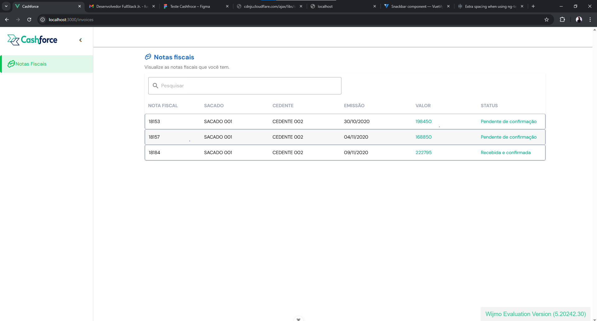

# Cashforce Technical Test

Projeto dockerizado utilizando **Node.js**, **Sequelize**, **MySQL** e **Vue.js**.

---

## Stacks Utilizadas e Benefícios

- **Node.js**: Plataforma eficiente para aplicações web escaláveis, com grande ecossistema de bibliotecas.
- **Express**: Framework minimalista para Node.js, facilita a criação de APIs REST robustas e rápidas.
- **Sequelize**: ORM para Node.js que simplifica o gerenciamento do banco de dados relacional, tornando queries e migrations mais seguras e produtivas.
- **MySQL**: Banco de dados relacional amplamente utilizado, confiável e de fácil integração com Node.js.
- **Vue.js**: Framework progressivo para construção de interfaces de usuário reativas e performáticas.
- **Vuetify**: Biblioteca de componentes UI para Vue, garantindo design moderno e responsivo.
- **Wijmo**: Utilizado para a criação da tabela principal do sistema, por ser uma ferramenta performática, flexível e muito utilizada no mercado para exibição de grandes volumes de dados em grids.
- **Docker**: Permite isolar e padronizar ambientes, facilitando o setup e a execução do projeto em qualquer máquina.

---

## Exemplo da interface

Abaixo, um exemplo da tela principal exibindo as notas fiscais em uma tabela criada com Wijmo:



---

## Como rodar a aplicação
Obs.: Para rodar a aplicação em sua máquina é necessário ter o Docker instalado, para maiores informações consulte a documentação oficial.
[https://docs.docker.com/get-started/]

### 1. Clone o repositório e acesse a pasta do projeto

```sh
git clone git@github.com:nelsonhamada/teste-tecnico-cashforce.git
cd teste-tecnico-cashforce
```

### 2. Suba os containers (Node, MySQL e Frontend) usando Docker Compose

```sh
docker-compose up -d
```

### 3. Acesse a aplicação

- **Frontend:** [http://localhost:3000](http://localhost:3000)
- **Backend (API):** [http://localhost:3001/main](http://localhost:3001/main)

---

## Comandos úteis para Sequelize

> **Obs.:** Não é necessário rodar migrations/seeders para funcionamento, pois o banco é criado via `init.sql`.  
> Use apenas se quiser testar as funcionalidades do Sequelize.

- Executar migrations:
  ```sh
  npx sequelize-cli db:migrate
  ```

- Popular o banco com seeders:
  ```sh
  npx sequelize-cli db:seed:all
  ```

---

## Estrutura dos diretórios

```
backend/
  src/
    controllers/
    database/
    models/
    routes/
    services/
    ...
  package.json
  Dockerfile
frontend/
  src/
  package.json
  Dockerfile
init.sql
docker-compose.yml
```

---

## Observações

- O banco de dados é criado automaticamente ao subir o container MySQL, usando o script `init.sql`.
- As variáveis de ambiente do banco já estão configuradas no `docker-compose.yml`.
- Para desenvolvimento, o volume `./backend/src:/app-backend/src` permite hot reload do código backend.
- O frontend está configurado para rodar na porta 3000 e o backend na porta 3001.

---
